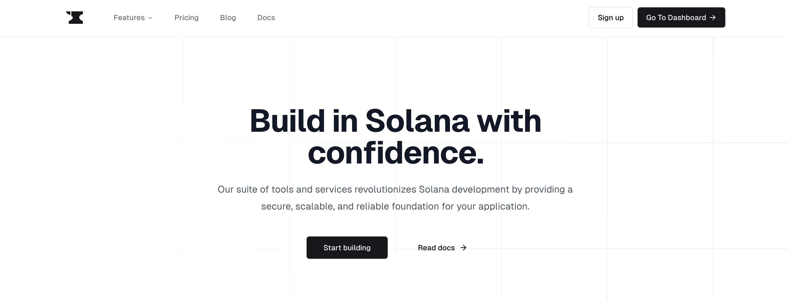
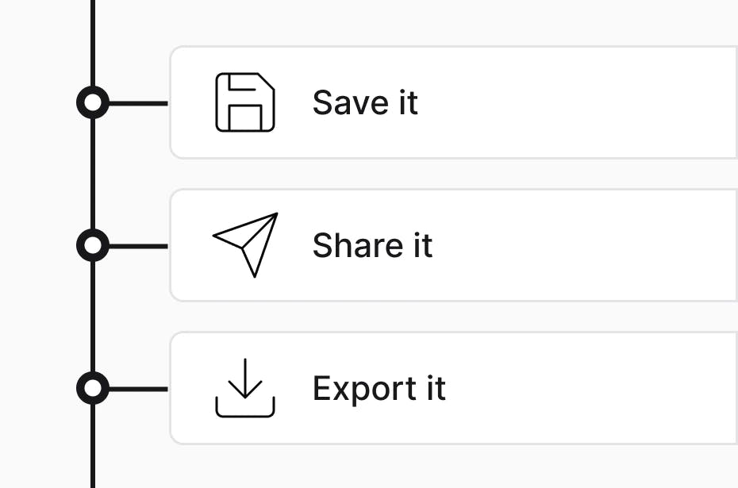
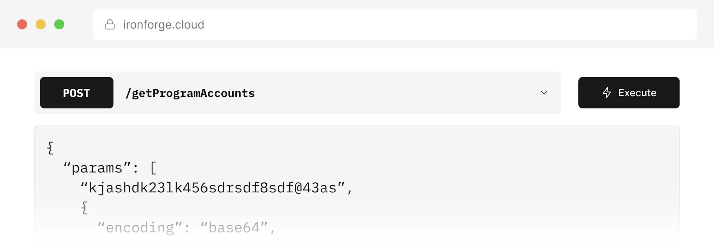

# Write a Twitter Thread on Ironforge

## Tweets
### Tweet 1:
Hi there  🙋‍♂️🙋‍♀️, Are you ready to embark on an epic journey with @IronforgeCloud, your trusty coding sidekick? 🛠️ Ready to dive into the wonderful world of Solana development? Hold onto your hats 🎩, this thread is your guide! 
#IntroToIronforge  #SolanaDev 

🧵 1/10

### Tweet 2:
Welcome to the magical realm of Ironforge's cool features! 🔮✨ These tools are like a superpower for coders, giving you the confidence 💪 to conquer any coding challenge. With Ironforge, you'll feel like a coding superhero! 🦸‍♂️🦸‍♀️ 
#IronforgeFeatures 

🧵 2/10

### Tweet 3:
Feel like a coding genius 🤓 as you breeze through projects with confidence using Ironforge's RPC Gateway! Say goodbye to complexities 🙅‍♂️ and hello to a world of coding excellence. 
#IronforgeRPCGateway #SolanaDev 

🧵 3/10

### Tweet 4: 
Ironforge RPC Gateway 🌐 is the ultimate problem-solver for all your Solana development worries! This magical tool is like a coding wizard 🧙‍♂️, making your life easier with smart analytics 📊, handy logs 📝, and ensures you enjoy uninterrupted service 💪. 

🧵 4/10

### Tweet 5:
Teamwork makes the dream work! 🤝 Ironforge makes it easy for coders to work together, share their creations, and save their code. It's like a coding party 🎉, where everyone is invited!  #IronforgeCollab #SolanaDev 

🧵 5/10

### Tweet 6: 
🚀 Elevate your Solana projects with Ironforge's collaborative prowess! 🔗 Share requests seamlessly, build a library for efficiency, and export code snippets effortlessly. Enhance cooperative effort. 🌐💻 
#IronforgeCollab #SolanaDev

🧵 6/10

### Tweet 7:
Welcome to the Ironforge Playground, where code ships faster than a cheetah 🐆 runs! This playground is like a coding wonderland 🌈, where you can test and share your code at lightning speed. 
#IronforgePlayground #ShipCodeFast

🧵 7/10

### Tweet 8: 
The Ironforge playground is like a coding rocket ship 🚀, helping you test requests super fast 💨, use a friendly interface 📲, and share your work with friends 👨‍💻. You'll feel like a coding superhero 🦸‍♂️ as you zip through your projects at light speed 💫!  

🧵 8/10

### Tweet 9: 
🚀 Elevate your coding game with Ironforge! 🌐 Whether you're a master or just starting, it's the ultimate tool for confidence, teamwork, and speed. Join the revolution at www.ironforge.cloud 💻🔥 
#TryIronforge

🧵 9/10

### Tweet 10:
🎉 Coders, congrats on reaching the end of our Ironforge journey! 🚀 But it's just the start of your coding adventure. With Ironforge, code with confidence, share, and ship faster than ever. Ready to begin? Visit www.ironforge.cloud now! 
#TryIronforge

🧵 10/10